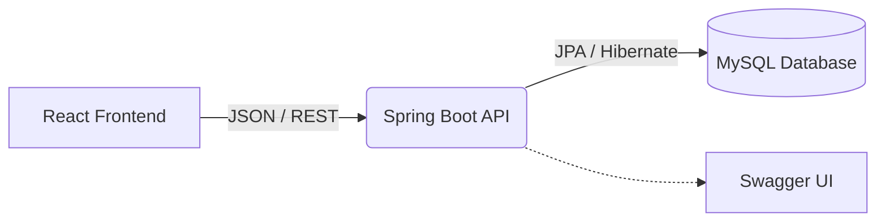

  
# 🏖️ Employee Leave Management System
**A modern, enterprise-ready portal for HR and Employees to manage time-off.**

## ✨ Features
* **Role-Based Access Control:** Distinct views and permissions for `HR` and `EMPLOYEES`.
* **Leave Balances:** Automated tracking and deduction of Annual, Sick, and Casual leave days.
* **Master Directories:** HR can manage company departments and the employee directory.
* **Modern UI:** Built with React, Lucide Icons, and a responsive CSS grid layout.
* **Secure API:** JWT-based authentication and a fully documented OpenAPI (Swagger) backend.

## 🏗️ Architecture

## 🚀 Quick Start
### 1. Database Setup
Ensure you have MySQL installed and running on `localhost:3306`.
Create a database named `employee_leave_db`.

### 2. Backend (Spring Boot)
1. Navigate to `Backend/employee-leave-management`
2. Run `mvn spring-boot:run`
3. The API will start on `http://localhost:8080`
4. View API Documentation at `http://localhost:8080/swagger-ui.html`

### 3. Frontend (React)
1. Navigate to `Frontend`
2. Run `npm install`
3. Run `npm run dev`
4. The UI will start on `http://localhost:5173`

## 🔑 Default Accounts (Seeded)
The system automatically generates mock data on first run. You can log in using:
* **HR Manager:** `hr@abccorp.com` / `hr123456`
* **Employee:** `john@abccorp.com` / `password`
